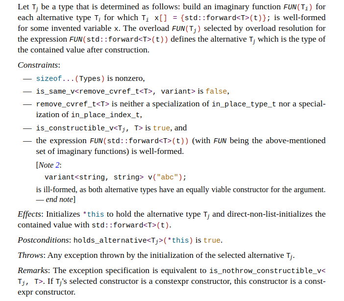
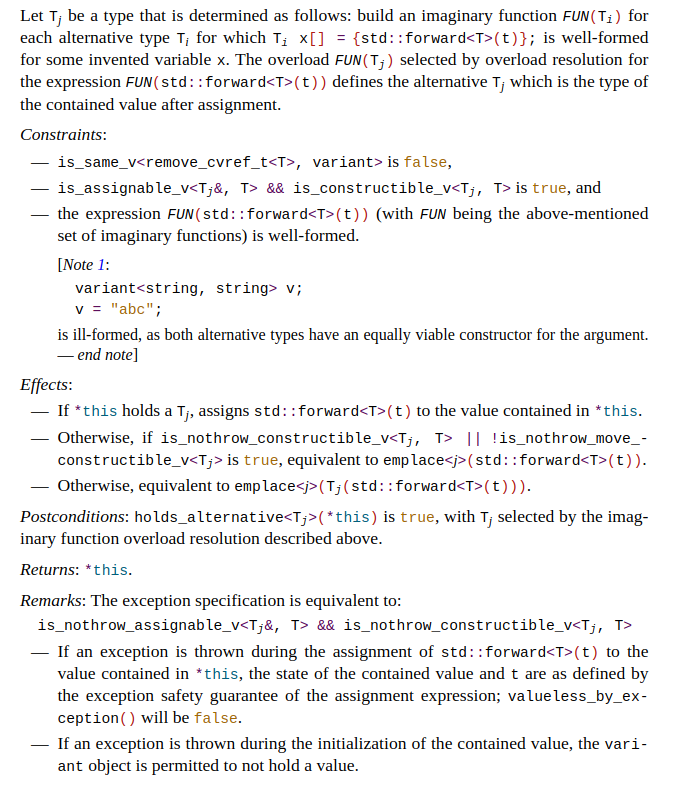

# Circle variant 

[**variant code here**](variant.hxx)

This is a Circle implementation of C++20's [`std::variant`](http://eel.is/c++draft/variant) class. The goal of this exercise isn't about providing a faster-compiling variant, although it it that. Like my [mdspan implementation](https://github.com/seanbaxter/mdspan#mdspan-circle), working through variant is an opportunity to extend the language so that writing such advanced code no longer poses a challenge.

The libstdc++ variant is [very scary](https://github.com/gcc-mirror/gcc/blob/master/libstdc%2B%2B-v3/include/std/variant). If the veteran C++ programmers who implemented this had so much trouble, what hope is there for the rest of is?

This new variant is a simple transliteration from standardese. It leverages a bunch of existing Circle features:

* [Data member pack declarations](https://github.com/seanbaxter/mdspan#data-member-pack-declarations)
* [Pack subscript operator](https://github.com/seanbaxter/circle/blob/master/universal/README.md#static-subscripts-and-slices) `...[]`
* [Pack index operator](https://github.com/seanbaxter/circle/blob/master/universal/README.md#pack-indices) `int...` and integer pack generator `int...(N)`
* [Multi-conditional operator](https://github.com/seanbaxter/circle/blob/master/conditional/README.md#multi-conditional---) `...?:`
* [Constexpr conditiontal operator](https://github.com/seanbaxter/circle/blob/master/conditional/README.md#constexpr-conditional--) `??:`
* [Member type traits](https://github.com/seanbaxter/circle/blob/master/imperative/README.md#type-traits) `.template`, `.type_args` and `.string` 
* Pack `static_assert`

But that wasn't enough for a clean variant. To address pain points discovered in variant, I implemented two more major features:

1. `__preferred_copy_init` and `__preferred_assignment` provide the intelligence for the converting constructor and converting assignment operator. They perform overload resolution given an expression and a collection of types, and indicate the type that has the best viable construction or assignment, or failure if there is no viable operation, or multiple best-viable operations.
2. `__visit` and `__visit_r` is a multi-dimensional, single-expression visitor operator. It implements `std::visit` on any number of variant arguments in one line.

## Member pack unions, constructor and destructor.

The [mdspan implementation](https://github.com/seanbaxter/mdspan#mdspan-circle) introduced data member [data member pack declarations](https://github.com/seanbaxter/mdspan#data-member-pack-declarations). In that application, non-static data members of a class were declared variadically. In this exercise, _variant members_ and their subobject initializers are declared variadically.

[**variant.hxx**](variant.hxx)
```cpp
template<class... Types>
class variant {
  static constexpr bool trivially_destructible = 
    (... && std::is_trivially_destructible_v<Types>);

  union {
    Types ...m;
  };

  uint8_t _index = variant_npos;

public:
  constexpr variant() 
  noexcept(std::is_nothrow_default_constructible_v<Types...[0]>) 
  requires(std::is_default_constructible_v<Types...[0]>) : 
    m...[0](), _index(0) { }

  constexpr ~variant() requires(trivially_destructible) = default;
  constexpr ~variant() requires(!trivially_destructible) { reset(); }

  constexpr void reset() noexcept {
    if(_index != variant_npos) {
      _index == int... ...? m.~Types() : __builtin_unreachable();
      _index = variant_npos;        // set to valueless by exception.
    }
  }
};
```

Use the `...member-name` _declarator_ syntax inside a _union-specifier_ to declare a pack of variant members. We no longer have to use inheritance to implement `std::variant` -- it's all one self-contained class.

Since we have an unnamed union with potentially non-trivially constructible members, we should specify a subobject initializer for the first variant member in the variant class's default constructor. Circle features a pack subscript operator `...[N]`, which is used to specify:
* The _noexcept-specifier_ for construction of the first variant member,
* The _requires-clause_ constraint that deactivates the constructor if the first variant member isn't default constructible, and
* Subobject access to the first variant member in the unnamed unions.

### Conditionally trivial destructor.

C++20 permits conditionally trivial destructors, in which multiple destructors are declared, marked by different _requires-clauses_, one of which may be marked `= default`, to create a trivial destructor. When the class is made complete (when the parser hits the closing brace of its definition, or when it's instantiated into a template specialization), the destructor constraints are evaluated and exactly one destructor candidate is chosen.

```cpp
  constexpr ~variant() requires(trivially_destructible) = default;
  constexpr ~variant() requires(!trivially_destructible) { reset(); }
```

If all variant members have trivial destructors, we default the destructor's definition. This will suppress any code generation for the destructor.

### Multi-conditional reset.

If any variant member has a non-trivial destructor, like an `std::string` that should deallocate dynamic memory, the user-defined destructor is defined, which delegates to the `reset` member function.

```cpp
  constexpr void reset() noexcept {
    if(_index != variant_npos) {
      _index == int... ...? m.~Types() : __builtin_unreachable();
      _index = variant_npos;        // set to valueless by exception.
    }
  }
```

`reset` is where the choice of a member pack union starts paying off. We want to switch over all valid indices (that is, all indices exception `variant_npos`, which indicates the _valueless by exception_ state) and call the destructor of the corresponding variant member. Using the [multi-conditional operator](https://github.com/seanbaxter/circle/blob/master/conditional/README.md#multi-conditional---) `...?:`, this is performed with a single expression:
```cpp
      _index == int... ...? m.~Types() : __builtin_unreachable();
```

`_index` is our scalar index of the currently-set variant member. `int...` is a pack expression, which when substituted as part of a pack expansion expression `...`, yields back the current index of the expansion as an index. This pack expression infers the pack size from other pack expressions in the same expansion. 

`_index == int...` is a pack of comparison expressions. For a variant with four alternatives, it'll expand out like this:
```
(_index == 0, _index == 1, _index == 2, _index == 3)
```

Of course, only one of these can be true. Each of these comparisons serves as the left-hand side of a conditional operator. We want to effect an operation like this:
```cpp
_index == 0 ? m...[0].~Types...[0]() :
_index == 1 ? m...[1].~Types...[1]() :
_index == 2 ? m...[2].~Types...[2]() :
_index == 3 ? m...[3].~Types...[3]() :
              __builtin_unreachable();
```

The multi-conditional operator `...?:` will expand out the left, middle and right-hand operands to generate precisely that.

```cpp
      _index == int... ...? m.~Types() : __builtin_unreachable();
```

* The left-hand operand is the predicate, which yields true when we're substituting on the index corresponding to the active variant member. 
* The center operand calls the _pseudo-destructor_ on the member pack declaration `m`. The type of the _pseudo-destructor_ is the `variant` template parameter `Types`. During pack expansion, the i'th variant member and i'th `Types` element are substituted in concert, forming a valid desturctor operation.
* The right-hand operand is `__builtin_unreachable()`. This is compiler lingo for noting that a branch of execution is unreachable. It allows the optimizer to employ _strength reduction_ passes to improve code quality. We're basically telling the compiler that we've accounted for all code paths, even the unreachable ones.

## Copy construction.

```cpp
  // Copy ctors.
  constexpr variant(const variant& w)
  requires(trivially_copy_constructible) = default;

  constexpr variant(const variant& w)
  noexcept(nothrow_copy_constructible) 
  requires(copy_constructible && !trivially_copy_constructible) {
    if(!w.valueless_by_exception()) {
      int... == w._index ...? 
        (void)new(&m) Types(w. ...m) : 
        __builtin_unreachable();
      _index = w._index;
    }
  }
```

If all variant members are trivially copy constructible, a _requires_clause_ selects the default definition, so that the emitted copy constructor is a simple `memcpy`. Otherwise, the user-defined copy constructor is selected.

The multi-conditional operator `...?:` does all the work, as it will do over and over in this variant implementation. The predicate for the conditional is a comparison of the current pack index with the active variant member of the rhs. When that predicate is true, we need _placement-new_ to invoke the copy constructor of the variant member that's going to become active. The syntax is `new(pointer) Type(arguments)`. But we have to do this as a pack, with a bunch of separate pack elements:
* The pointer to the active member is a pack, `&m`. For each element of the pack expansion instantiated, this will yield the address the corresponding variant member in the union.
* The type of the active member, is a pack, `Types`. 
* The initializer exprsession of the active member is a pack, `w. ...m`. `w` is a parameter of a _dependent type_, `variant`. Although this is also the type of _current instantiation_, C++ rules require the compiler to defer name lookup until instantiation, only then will subobjects of dependent base classes be known. The `...` token that precedes the _member-id_ indicates that, upon name lookup, the member will be a pack declaration. We can't currently write `w....m`, because greedy lexing rules would tokenized that is `w... .m`, which is nonsense. If you forget to put the `...` disambiguating token before the member name, the compiler will remind you when you instantiate the template.

```cpp
  constexpr variant(variant&& w)
  noexcept(nothrow_move_constructible)
  requires(move_constructible && !trivially_move_constructible) {
    if(!w.valueless_by_exception()) {
      int... == w._index ...? 
        (void)new(&m) Types(std::move(w. ...m)) : 
        __builtin_unreachable();
      _index = w._index;
    }
  }
```

The move constructor is defined exactly the same way, except we use `std::move` in the _placement-new_ initializer.

## Converting constructor.

[](http://eel.is/c++draft/variant#ctor-14)

The Standard challenges us with a wall of text for the converting constructor. But the Circle implementation of this function is _very simple_.

```cpp
  template<typename T, int j = __preferred_copy_init(T, Types...)>
  requires(
    -1 != j &&
    T.remove_cvref != variant && 
    T.template != std::in_place_type_t &&
    T.template != std::in_place_index_t && 
    std::is_constructible_v<Types...[j], T>
  )
  constexpr variant(T&& arg) 
    noexcept(std::is_nothrow_constructible_v<Types...[j], T>) :
    m...[j](std::forward<T>(arg)), _index(j) { }
```

## `in_place_type_t` constructor.

```cpp
template<class... Types>
class variant {
  template<typename T>
  static constexpr size_t find_index = T == Types ...?? int... : -1;

  union {
    Types ...m;
  };

  uint8_t _index = variant_npos;

public:
  template<class T, class... Args, size_t j = find_index<T> >
  requires(is_single_usage<T> && std::is_constructible_v<T, Args...>) 
  explicit constexpr variant(std::in_place_type_t<T>, Args&&... args)
  noexcept(std::is_nothrow_constructible_v<T, Args...>):
    m...[j](std::forward<Args>(args)), _index(j) { }
};
```cpp


## Copy assignment.


## Converting assignment.

[](http://eel.is/c++draft/variant#assign-11)

```cpp
  template<class T, size_t j = __preferred_assignment(T&&, Types...)>
  requires(T.remove_cvref != variant && -1 != j &&
    std::is_constructible_v<Types...[j], T>)
  constexpr variant& operator=(T&& t) 
  noexcept(std::is_nothrow_assignable_v<Types...[j], T> &&
    std::is_nothrow_constructible_v<Types...[j], T>) {
 
    if(_index == j) {
      // If *this holds Tj, assigns std::forward<T>(t) to the value contained
      // in *this.
      m...[j] = std::forward<T>(t);
 
    } else if constexpr(std::is_nothrow_constructible_v<Types...[j], T> ||
      !std::is_nothrow_move_constructible_v<Types...[j]>) {
 
      // Otherwise, if is_nothrow_constructible_v<Tj, T> || 
      // !is_nothrow_move_constructible_v<Tj> is true, equivalent to
      // emplace<j>(Tj(std::forward<T>(t))).
      reset();
      new(&m...[j]) Types...[j](std::forward<T>(t));
      _index = j;
 
    } else {
      // Otherwise, equivalent to emplace<j>(Tj(std::forward<T>(t))).
      Types...[j] temp(std::forward<T>(t));
      reset();
      new(&m...[j]) Types...[j](std::move(temp));
      _index = j;
    }
 
    return *this;
  }
```

## Comparison and relational operators.

[](http://eel.is/c++draft/variant#relops-5)

```cpp
template<class... Types>
constexpr bool operator<(const variant<Types...>& v, 
  const variant<Types...>& w) {

  static_assert(requires{ (bool)(get<int...>(v) < get<int...>(w)); }, 
    Types.string + " has no operator<")...;

  // Returns:
  //  If w.valueless_by_exception(), false;
  //  otherwise if v.valueless_by_exception(), true;
  //  otherwise if v.index() < w.index(), true;
  //  otherwise if v.index() > w.index(), false;
  //  otherwise get<i>(v) < get<i>(w) with i being v.index().
  return w.valueless_by_exception() ? false :
    v.valueless_by_exception() ? true :
    v.index() < w.index() ? true :
    v.index() > w.index() ? false :
    int...(sizeof...(Types)) == v.index() ...? 
      v.template get<int...>() < w.template get<int...>() :
      __builtin_unreachable();
}
```

## Visit

```cpp
template <class Visitor, class... Variants>
constexpr decltype(auto) visit(Visitor&& vis, Variants&&... vars) {
  if((... || vars.valueless_by_exception()))
    throw bad_variant_access("variant visit has valueless index");

  return __visit<variant_size_v<Variants.remove_reference>...>(
    vis(std::forward<Variants>(vars).template get<indices>()...),
    vars.index()...
  );  
}
```


